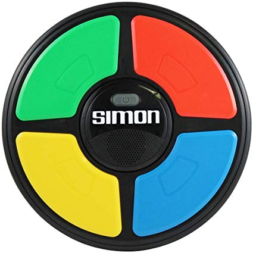

<h1 align="center">Simon Game</h1>

<div align="center">
https://github.com/murphya14/Simon-game.git
</div>

<h1 align="center">

</h1>

<div align="center">
This is an Interactive Frontend website for an engaging memory game; *The Simon Game*.<br>
The purpose of this website is to provide a challenging game that allows for an energetic User Interface and captures the attention of the player.
This game has stood the test of time and has been a popular choice for over **40 years!**


This is a game that appeals to __all ages__. There is the
option of a more challenging game by using the __Strict Mode__ setting which allows the game to cater to all levels.<br>
The aim of this website is to provide an energetic game that is pleasing both visually and audibly.

[**View Simon Game website here!**](https://murphya14.github.io/Simon-game/)
<div>

## UX Design

__Purpose:__<br>
The purpose of this website is to provide a challenging and fun game for all users.
Clear instructions are provided to make the users aware of the how the game is run.

__The target customer has the following qualities:__
* Looking for a challenge
* Wants a game that is interactive (both visually and audibly.)
* Suitable for ages 3+

__The goal for visitors to the site, created the following brainstorm for the
User story:__

- #### As a player, I would like to see:
   - a striking design that is visually stimulating and provides an incentive to play the game.
   - I want to be able to access information so I can understand more about the game.
   - I want to be able to control the power button so I can experience the interactive nature of the game.
    - I want to be able to control the start button so as to begin when I am ready.
    - I want to be able to set a challenge level.
     - I want to be able to get instant feedback on whether I have lost/game over or gone ahead to the next level/win.

Wireframe Mock-ups using [Balsamiq](https://balsamiq.com/)
* [Main Desktop Display](assets/css/images/main-wireframe-desktop.pdf)
* [Information modal Desktop Display](/assets/css/images/modal-wireframe-desktop.pdf)
* [Main Tablet Display](/assets/css/images/main-wireframe-tablet.pdf)
* [Information modal Tablet Display](/assets/css/images/modal-wireframe-desktop.pdf)
* [Main Mobile Display](/assets/css/images/main-wireframe-mobile.pdf)
* [Information modal Mobile Display](/assets/css/images/modal-wireframe-mobile.pdf)


##Design
The design is a reflection of the original game.

###Fonts
*The font BLAH was used as the primary font so as to

###Colour
*The main header and footer are black with contrastin white text. The comment that is the "catch phase" of the game is highlighted in neon pink.
*The Simon border for the padding is a strong balck that opposes the primary colours of the game and matches the header and footer.
*The pads are the four primary colours and match the original game.
*Inner circle - This is where the control buttons are. It is black which gives the illusion of a physical object like the original game and contrast against the control buttons.
*Start button/Power Button - Faded green colour but once clicked both are highlighted.
*Strict Slider - this is labelled and white. Once turned on it becomes red which reflects the challenge that it represents.
*Game-info button - A neon pink that stands out, adds to the retro feel that this game represents and matches with the intriging comment.

###Styling
The styling is in line with the original game and incorporates flashing and audio to make the game even more engageing.


## Features
### Existing Features
#### Feature 1
_Dashboard:_
*This is a __interactive__ dashboard which welcomes the user with striking imagery that allows for an intuitive feel for the game.


#### Feature 2
_Game Information modal:_
*Clear access to the information about "How to play" is shown with a modal button.
*This is a fixed modal in bright pink to catch the users attention.


#### Feature 3
_Coloured Pads:_
*The four pads are faded and only light up once the power button has been clicked.
*The pads are primarily where the user interacts with the game.
*You can only click the pads when it is the players turn.


#### Feature 4
_Power and Start button:_
*The power button must be clicked before the start button and this has been carefully programmed to follow this sequence.
*Once the power button has been clicked the pads light up and the score board reflects that the power is on.
*Once the start button is pressed the game reacts by fading the pad lights and the score board reflects the beginning of the game
by showing zero.

#### Feature 5
_Strict Slider:_
*This is slider button is off by default and when slide on, it reflects this through a colour change.

#### Feature 7
_Scoreboard:_
*Once the page is loaded the score board will be empty.
*With the power button clicked it will show "--"
*Once start is clicked the scoreboard begins at "0"

#### Feature 8
_Header & Footer:_
*Footer copyrighting the design.
*Navigation bar boldy showing the name of the game and an intriging comment that hints at the games nature.

### Features to implement in the Future
* A range of levels including rotation of the pads to tailor for more abilities.
* Prompting modals that appear subtly as you hover over buttons to inform the player as they go.
* An optional trial game to allow new players to test it out before commiting to a game.
* A follow up message that challenges the player to another game.
* A functional calender keeping track of the players score over the course of time. This prompts the player to competively beat their previous scores.


## Technologies Used
* __HTML, CSS & JavaScript:__
This project was created using HTML, CSS and javaScript.

* __Cloud9:__
This project was written on Cloud9 and gitpod.
<br>https://c9.io/login
<br>https://www.gitpod.io/

*__JQuery:__
Used to work more efficiently with the DOM.
<br>(https://jquery.com)

*__Jasmine__
A Test Driven Development tool to test JQuery and javaScript.
<br>(https://jasmine.github.io/)

*__Jasmine__
Used to allow JQuery be tested using jasmine.
<br>(https://github.com/velesin/jasmine-jquery)

* __W3C online validators:__
Online validators were used to check code was valid for both HTML and CSS.
<br>HTML validator: https://validator.w3.org
<br>CSS Validator: http://jigsaw.w3.org/css-validator/

* __BootstrapCDN:__
Bootstrap 4 was utilised to create a resposive web page and give a framework to the website.
<br>https://getbootstrap.com/

* __Font Awesome:__ Provided icon for tab. <br>https://fontawesome.com/


* __Google Fonts:__ The main font was sourced from <br>https://fonts.google.com/

* __Auto prefix tool:__ This tool allowed me to insure cross-browser compatability.
<br>https://autoprefixer.github.io/

* __Git:__ Pushed Local git repository to remote repository on GitHub.
<br> https://git-scm.com/
<br>https://github.com/

* __CSS Colour Codes:__ Used to obtain the colours for the project.
<br>https://www.quackit.com/css/css_color_codes.cfm


## Testing

Testing information can be found in separate [TESTING.md file](https://github.com/murphya14/Fitness-website/blob/master/TESTING.md)

## Deployment

This project was created using the [Cloud9 IDE](https://c9.io), committed to git and then pushed to GitHub.

To deploy this page to GitHub Pages from its [GitHub repository](https://github.com/murphya14/Simon-game.git), the following steps were taken:
1. Log into GitHub.
2. In the repositories, select **murphya14/Fitness-webpaget**.
3. Select **Settings** which is below the navigation bar.
4. Go to the **GitHub Pages** section.
5. Click the **Source** menu and select **Master Branch**
6. The website is now deployed.
7. Scroll back to **GitHub Pages** section to find the link.


### How to run this project locally

Cloning this project from GitHub:
1. Follow this link to the [Simon Game Github repository](https://github.com/murphya14/Simon-game.git).
2. Click the green button on the right hand side of the screen named "Clone or download".
3. Copy the URL shown for the repository.
4. Open a terminal in your local dev environment.
5. Change working directory to the location where you want the cloned directory to be made.
6. Type ```git clone```, and then paste the URL you copied.
```console
git clone https://github.com/murphya14/Simon-game.git
```
7. Press Enter to create your local clone.


## Credits

* I received inspiration from researching other projects such as [Free Code Academy](https://github.com/beaucarnes/simon-game)

### Disclaimer
The content of this Website is for educational purposes only.


